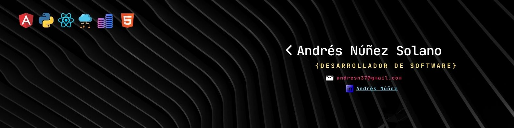

<h2 align="center">Hello World! I'm Andrés ✨</h2>

  

 

👨‍💻 **About Me**

Hi! I’m Andrés Núñez, a passionate and versatile Application Developer with 15+ years of experience in tech roles across banking and fintech sectors. I specialize in building and optimizing custom IT solutions that solve real business problems — from backend logic and database design to dashboards, APIs, and full automation flows.
With a strong foundation in SQL, C#, JavaScript, HTML/CSS, Power BI, and VBA, I’ve led the design, development, and delivery of multiple applications across Latin America and the Caribbean — consistently driving efficiency, automation, and scalability.

💻 **Tech Education**

🎓 Bachelor’s in Systems Engineering – Universidad Americana (2020–2023)
📚 Business Management Studies – Universidad de Costa Rica (2003–2007)

🛡️ **Next Career Goals**

I’m currently seeking a role as a Fullstack Developer or Backend Developer, ideally in a dynamic and remote-first environment where I can contribute with both technical execution and strategic thinking.
In the next months, I’ll continue deepening my skills in Java Core, Spring Boot, and Cloud deployment.

🌐 **Languages**

* General English level: **B2** | Spoken English: **B1**

🧠 **Core Competencies**

💻 Fullstack Web Development: Proficient in building responsive, dynamic applications using React, Angular, HTML/CSS, and JavaScript.
🐍 Python: Applied in automation, data manipulation, and scripting for backend and utility tools.
🔍 Analytical mindset with strong attention to detail, ensuring clean code, modular design, and high performance.
⚡ Exceptionally fast learner, able to adopt new technologies and frameworks quickly.
🔄 Highly adaptable, thrives in agile environments and cross-functional collaboration.
🤖 Passionate about Artificial Intelligence, automation, and continuous improvement in software engineering.

🚀 I’m actively looking for new job opportunities, preferably **100% remote**. If your company values versatility, commitment, and a passion for learning, I’d love to connect.

📬 Open to proposals and collaborations!

<h3>Andrés</h3>

<h2 align="center">Known Technologies👨🏻‍💻</h2>
<!--tech stack icons-->

  

